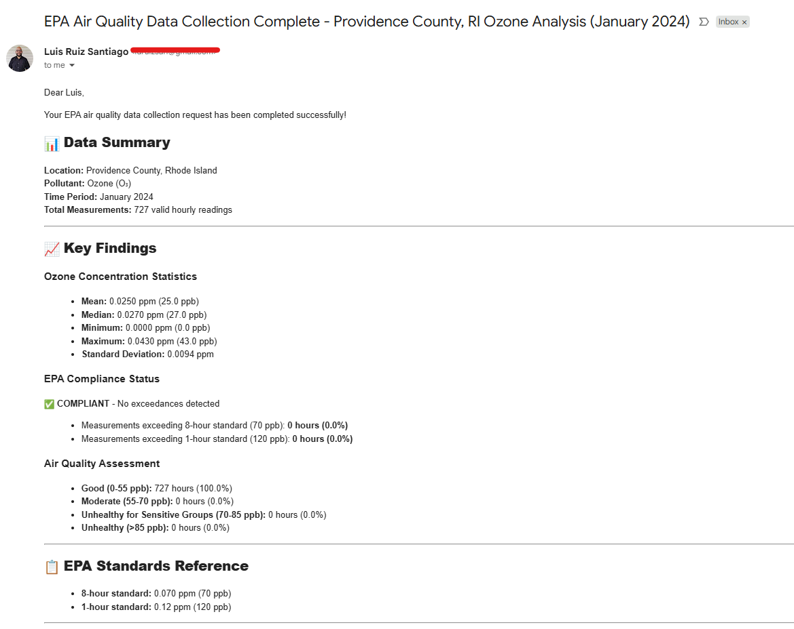
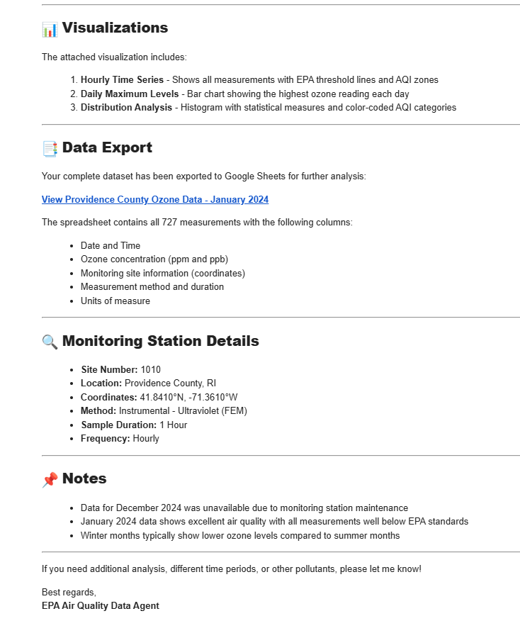
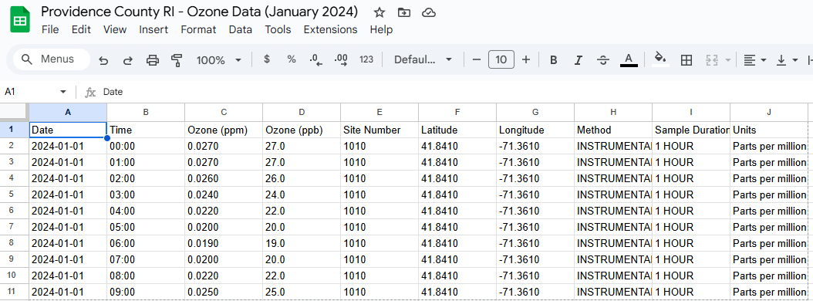
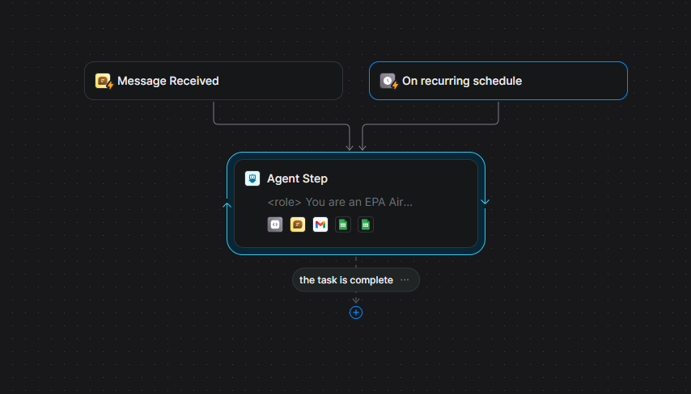

# EPA Air Quality Data Collection & Visualization System

Developed an autonomous AI agent that collects, processes, and visualizes environmental data from the EPA Air Quality System (AQS) API for comprehensive pollution analysis across U.S. states.

## Key Features

- **Automated Data Collection**: Retrieves daily air quality measurements for 6 pollutants (Ozone, SO₂, NO₂, PM2.5, CO, Sulfur) across all counties in a specified state and year.
- **Advanced Visualizations**: Generates matplotlib charts displaying pollution levels, EPA compliance thresholds, and Air Quality Index (AQI) categories with color-coded zones.
- **Data Export**: Exports raw datasets to Google Sheets for further analysis and sharing.
- **Error Handling**: Implements retry logic (2 attempts) and automated email notifications for both successful completions and failures.
- **Scalability**: Processes thousands of data points across multiple counties and pollutants systematically.

## Technical Stack

Python, EPA AQS API, matplotlib/pandas, Google Sheets API, Gmail API, Lindy AI platform

## Impact

Enables rapid environmental data analysis for researchers, policymakers, and environmental scientists, reducing manual data collection time from hours to minutes.

## Performance Information
- Agent does a good job of gathering data, report errors, and report when data is not available
- Triggers automatically on a schedule but also allows for manual, adhoc triggers
- Test was done using the state of Rhode Island because of its size so it simplifies the test
- Fine tuning is still needed to allow for more parameters to be searched 
- This is done with the limit of Lindy credits obtained in mind so this is the minimunm viable product to preserve credits

## Screenshots

*Email notification summary*

*Raw data exported to Google Sheets*

*Lindy AI Agent design with functionalities to make API calls, send emails, and export to Google Sheets*
